# DESIGN DOCUMENTATION
## 1. Design
### 1a. Overview
The program is an interactive sliding puzzle game. At the beginning of the game, the user can choose any dimensions from 3×3 to 10×10. After that, the program will ask the user to input four letters to represent the four directions. For a 3×3 puzzle, it consists of 8 numbers from 1 to 8 and a space. A 4×4 puzzle consists of 15 numbers from 1 to 15 and a space. Higher dimensions are similar. Then, the program will generate a solvable puzzle randomly. The user can move a digit with the keyboard using the 4 letters he chose before, one at a time, to the currently unoccupied space until all numbers appear sequentially, ordered from left to right, top to bottom. At this time, he has successfully completed the game. The program will ask the user if he wants to start a new game or end the game.

### 1b. Data Model
In this program, I mainly use four different data types: list, int, str and bool.
* **list**:  
1. a: a list used to store the numbers of the puzzle. It is a single-dimensional list.
2. directions: a list used to store the four letters which represent the four directions.

* **int**:
1. state: game status flag, 0 means a game is over, 1 means the game is in progress, 2 means the input is illegal.
2. step: represents the number of steps in the game.
3. n, N: n is the dimension of the puzzle, which is input by the user. N is the square of n.
4. num: the number of Count Inversions of the list a. (used to find the state quantities)
5. F: the value of the state quantities. (used to judge whether a puzzle is solvable)
6. zero_row, zero_index: zero_row is the row of the string '0' (represents the empty space) in the puzzle. zero_index is the index of the string '0' in the list a.
7. length: the length of the largest number in the puzzle. (used to facilitate formatted output)

* **str**:
1. L, R, U, D: they are used to store the letter represents left, right, up and down respectively.
2. next_step: represents the next step input by the user.
3. option: represents the choice by the user when he complete a puzzle successfully. (start a new game or end the game)

* **bool**
1. is_solvable(a): The return value of this function is True or False, represents whether the puzzle is solvable or not.
2. is_win: True or False, used to judge whether user user has completed the puzzle after a step.

### 1c. Program Structure
> Reminder: The text is a brief description, the program structure diagram which is more detailed. 

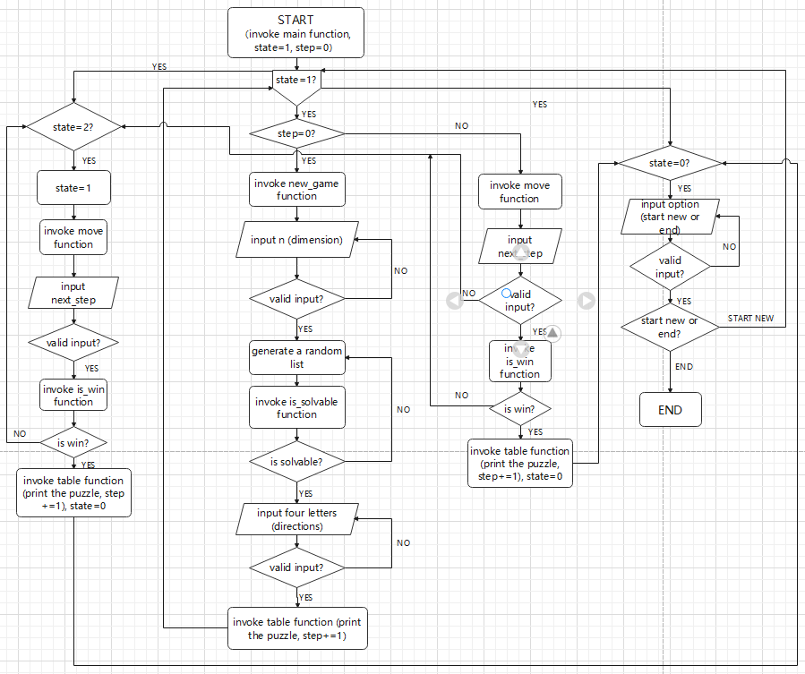

Description: (The bold parts are functions and the italicized parts are variables)
In this program, we first invoke the **main** function. There is a big while loop in this function. The condition is *state* equals to 1. At the beginning, *state* is 1 (the game is in process) and *step* is 0. Then, we will invoke the **new_game** function. This function allow the user to input the dimension and the four letters to represent the directions. In this function, the function **is_solvable** is invoked to judge whether the random puzzle is solvable. If True, then generate a list which can be convert to the puzzle. Else, a new random puzzle will be generated, until a solvable one appears. After that, the function **table** will be invoked, which prints the initial puzzle at this time and increase *step* by 1. Then, the big while loop runs a new time. In this time (and the later times) the **move** function will be invoked, then the user can input a letter he has chose to move a digit to the empty space. If his input is valid, then the **move** function will be invoked repeatedly. But if his input is invalid, *state* will become 2. And the user should input twice until he enter a valid input. Every time when we invoke the **move** function, the **is_win** function is be invoked, to judge whether the user completes the puzzle successfully at this time. If True, **state** will become 0 and we will ask the user to choose whether he wants to start a new game or not. If he wants, we will repeat the process above. If he does not want, the program will end.

### 1d. Processing Logic
#### i. The main processing logic:  
I use the variable *state* to represent the game status flag, 0 means a game is over, 1 means the game is in progress, 2 means the input is illegal. At the beginning, state is 1, so the game works. In this process, first, the program ask the user to input the dimension of the game and any four letters to represent the directions. If the input is not valid, the user will be asked to input again. Then, the program can generate a random puzzle which is solvable. The user can use the four letter he has chose to move the digits, once at each time. The program will check whether the user give a invalid input, if so, he should input again. If the user win the game, the program will ask him whether he wants to start a new game or not. The user can input to give an option.

#### ii. My technique to generate the randomized puzzle:
I first use list() function to get an ordered list.

Then, I use the random.shuffle() method in **random** module to shuffle this ordered list randomly.

  

After that, I check whether the list is solvable, if is, I print this list (convert to a puzzle), else, I will shuffle the ordered list repeatedly until I get a solvable list. 

To determine if a puzzle is solvable, the first step is to determine whether the current state quantity is the same as the state quantity in victory. The state quantity must be conserved.  
**The key question is what is the state quantity**  
There's a concept here: Count Inversions.  
Definition: in a sequence a, we have $a_i$ > $a_j$ and i < j, we call $a_i$ and $a_j$ are a pair of Count Inversions.  
Take a look at how the movement of Spaces in the digital volumetric channel changes the quantity of states:  
Taking n=4 as an example, the 4*4 sliding puzzle is extended into a number sequence containing the numbers 1-15
So the winning state is 1,2,3,4,5,6,7,8,9,10,11,12,13,14,15,0 (Spaces denoted by 0)
The number of Count Inversions is zero. (the space is not taken into account when calculating the inversion pairs.)
In this case, the state quantity is defined as 0 (where the odd number is 1, and the even number is 0).
Now try to move the space, we can see:
1. Moving a space left or right does not change the reverse log of the sequence
2. When a square has an odd number of sides, moving up and down one line will increase or decrease an even number of inversions
3. When a square has an even number of sides, moving up and down one line will increase or decrease an odd number of inversions

So the state quantities mentioned above will involve the following two quantities
1. The parity of the reverse logarithm of the current state sequence (denoted as S)
2. The parity of the change in the reverse logarithm generated by moving the space to the last line (denoted by M)

When n is odd, because moving up and down has no effect on the parity of the reverse logarithm, so the state quantity is going to be S
When n is even, moving up and down affects the parity of the reverse logarithm in the current state
So the state quantity is S^M, where the ^ is an XOR operation, the same is 0, the different is 1
At this point, the problem of solving the problem of whether a puzzle is solvable is transformed into the problem of solving the inverse logarithm

Therefore, I define two functions to calculate the state quantities and judge whether the puzzle is solvable.
The first function calculates the state quantities by enumeration

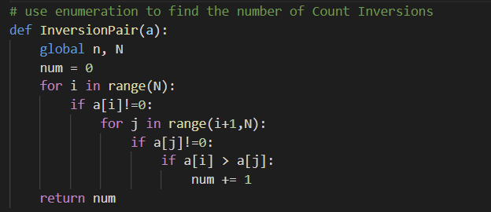

The second function help to judge whether the puzzle is solvable.

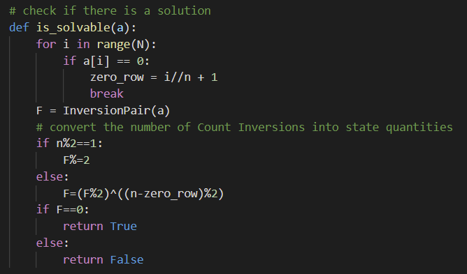

The whole precess to get a solvable list:  

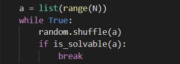

Then, I define a function table() to convert the list to a puzzle and print it.  

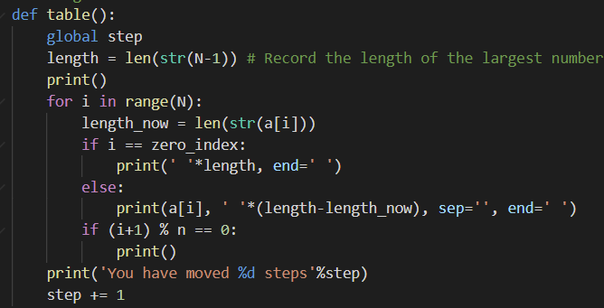

## 2. Function Specialization
* InversionPair(a)  

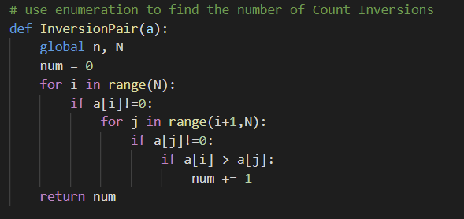

The function is used to calculate the number of Count Inversions of a list *a*.  
the variable n and N is global, n is the dimension which is input by the user. N is equal to $n^2$, means the length of the list.  
I use enumeration to get the result.  
The return value of this function is the number of Count Inversions of a list *a*.

* is_solvable()

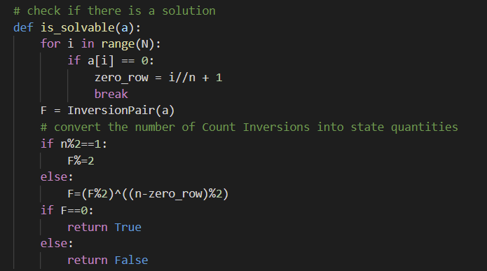

The function is used to check whether the generated puzzle is solvable. *a* is a list, *zero_row* is the row of zero, *F* is the number of Count Inversions of a, I get it by invoke function InversionPair(a). If it is solvable, the function returns True, else, returns False.  

* new_game()

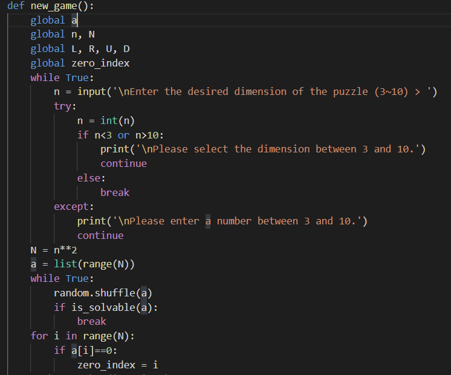
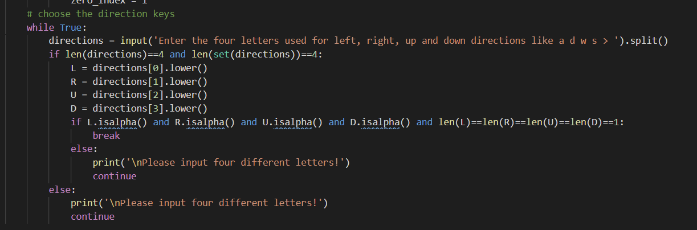

This function is used to implement the new game settings. It is an interaction with the user.   
There are there loops in this function. The first allows the user to input the dimension, the second generates a solvable list and get the index of zero in list a which is stored in *zero_index*. The third allows the user to input four letters which is used to represent the directions.

* is_win()

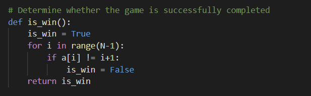

This function is used to determine whether the game is successfully completed. If is, return True, if not, return False

* move()

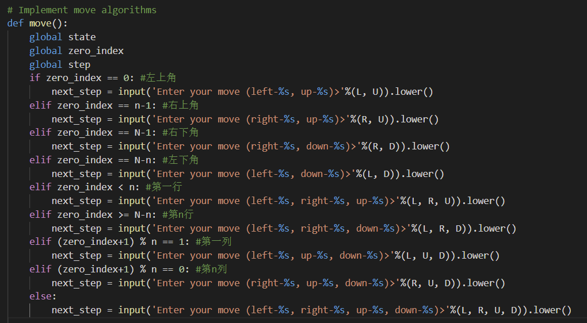
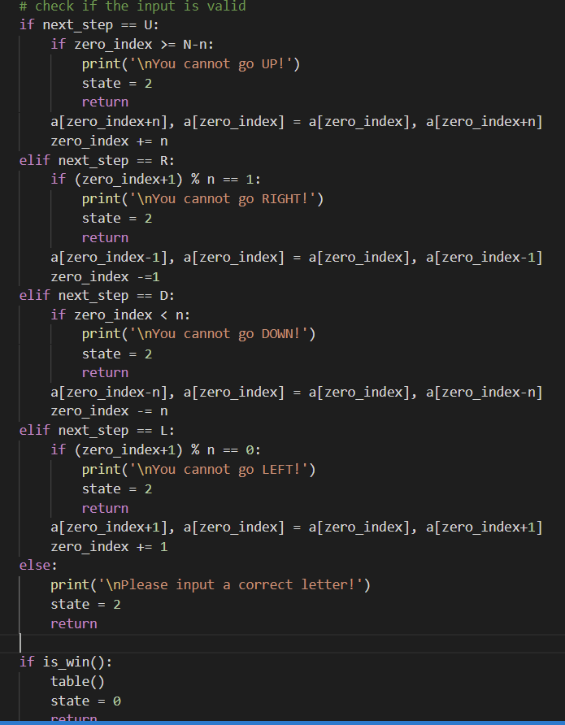

This function implement the move algorithms  
The first part of this function asks the user to input the next step and remind the user which steps can he choose. The letter can work no matter it is upper or lower.
The second part of this function checks if the user's input is valid. if is, the function will check whether the user complete the game, if not, it will change the state to 2, which means there is a invalid input and return. 

* table()

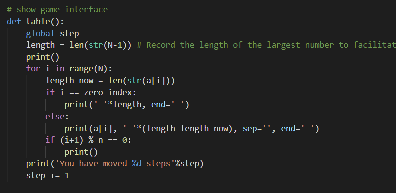

This function is used to convert the solvable list into a puzzle and print this puzzle. At the same time, the function can record the steps and also print it. The variable *length* records the length of the largest number to facilitate formatted output.

* main()

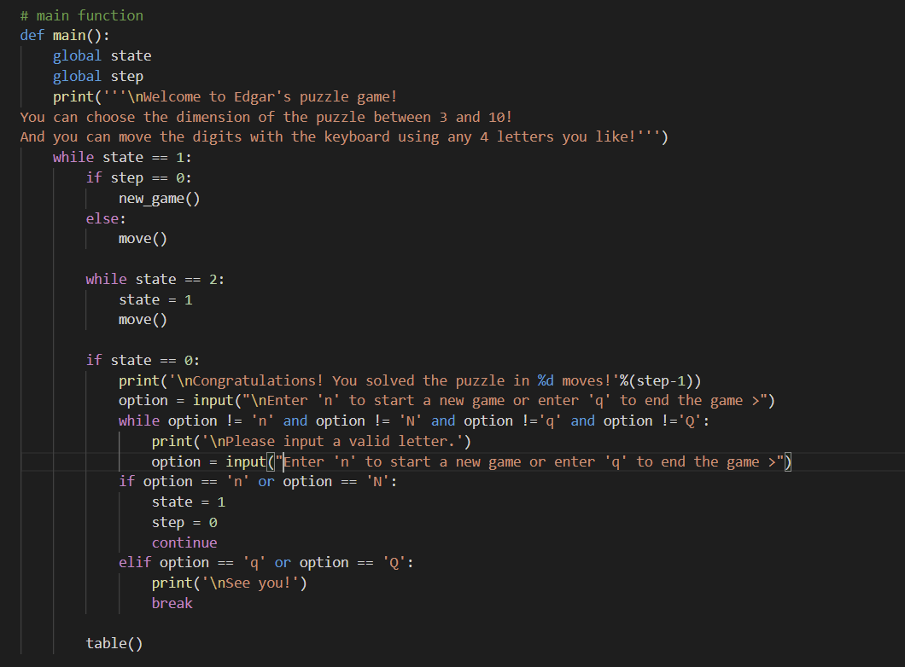

The function is the core processing function of this program. It contains the logic of how the entire game works. There is a big while loop in this function. The function can judge the state of the game and executes corresponding process. It integrates and calls the previous functions to implement the game's functionality. When the user completes the game successfully, it can also ask the user whether he wants to start a new game or not. More detailed of this function is difficult to express as text, you can look at the program structure diagram before.

## 3. Output
At first, there is a brief introduction and asked the user to input the dimension.

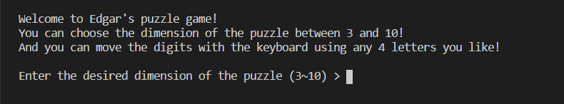

If the user fails to input a number between 3 and 10, the program will give a kind remind and ask him to input again.

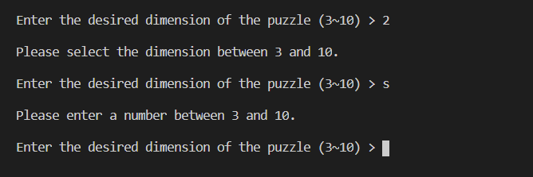

If we input a valid number, take 3*3 as an example. The program will ask the user to enter four letters. 

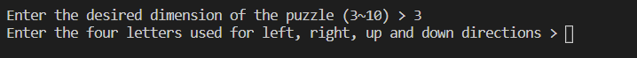

If the input is invalid:

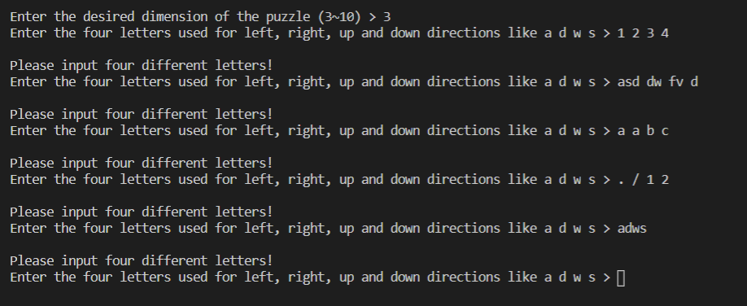

If valid:

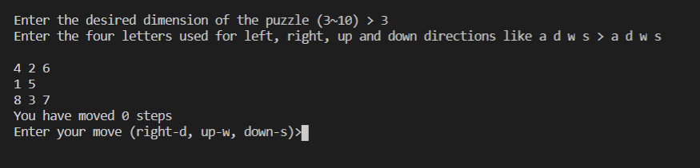

Then the user can input a letter in uppercase or lowercase to move a digit. (There is a kind remind)  
If the user inputs invalidly:

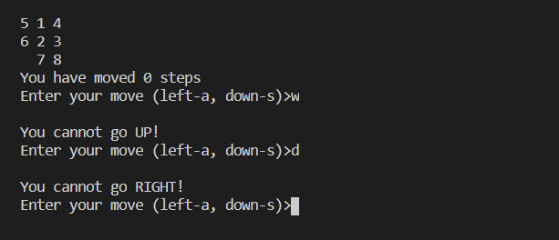

If valid, the program will show the following puzzle and the steps.

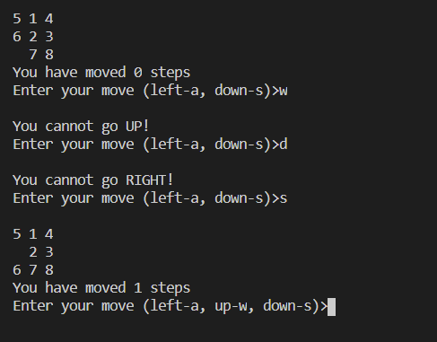

If win:

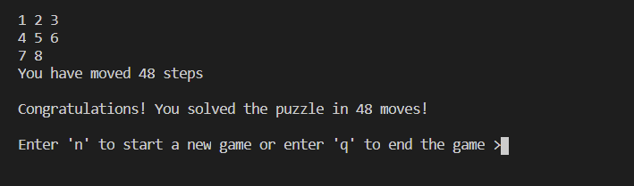

If then input is invalid:

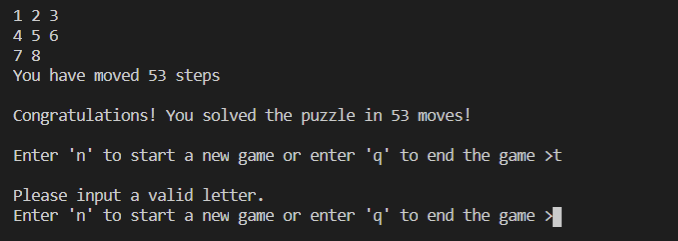

If the user input 'n', he can start a new game.

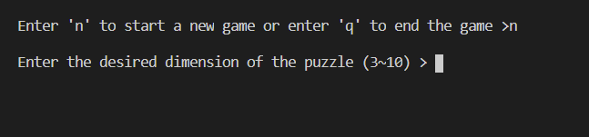

If the user input 'q', the game ends.

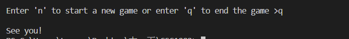

