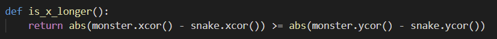

# DESIGN DOCUMENTATION
## 1. Design
### 1a. Overview
The program is an interactive snake game. The game is composed of 3 objects: a snake, a monster and food items represented by a set of numbers from 1 to 9. At the beginning of the game is the initial interface. The user can see a short introduction on this screen. Then, the user can click the screen to start the game. What's more, The user is allowed to move the snake with the keyboard using the four directional bottoms (up, down, right and left). Since that, the timer will start timing and the monster will start moving towards the snake’s head. The goal of the game is to maneuver the snake within the game area to consume all the food items while avoiding head-on collision with the monster.As each food item is consumed, the snake grows with its body lengthened in size equal to the value of the number being passed.

### 1b. Data Model
#### 1. snake including the tail
I use the turtle model to draw the head of the snake and its tail. I also use two lists **snake_x** and **snake_y** to store the coordinates of the snake including the tail (It means the coordinates of all the squares of the snake). What's more, I use a integer to represent the number of the tails which are being extended. 
#### 2. food items
I use the turtle model to draw the food items. And then, I use a list called **food_items** to store all the turtles which draw the food items. I also use a list called **eaten** to store the information about whether the food items have been eaten. (The values in this list are Boolean).

### 1c. Program Structure
> Reminder: The text is a brief description, the program structure diagram is more detailed and shows the main structure of the program.

* The first part is to set the initial interface. The following diagram shows the structure of this part.  

    

* Then, the user can click the screen to start the game. The structure diagram of this part:

    

* What's more, the user can maneuver the snake. The structure diagram of this part；

    

* Last but not least, after invoke the snake_move function, the structure of code which implement the movement of the monster is like this:

    

**Description**: (The bold parts are functions and the italicized parts are variables)  
In this program, we first invoke **set_screen** function to set the initial interface of the snake game. In this function, we create a variable *s* which represent the main screen. Then we create another variable *subtitles* to represent the subtitles of the game. And then, we invoke **set_board**, **set_contact**, **set_time** and **set_motion** functions to build the gaming board of the game.

Then, we invoke **snake** and **monster** functions to create two turtle objects to draw the snake and monster.

What's more, I use **onclick** method to allow the user to click the screen to start the game, the **start_game** function will be invoked at this time.

In start_game function, **food**, **set_key**, **run_time**, **run_motion** functions will be invoked first to set food items, keys, update time, motion status at the top of the board respectively.

And then, we invoke the **snake_move** function. In this function, we first invoke **is_win**, **is_lose** function to check whether we win or not. Then we invoke **is_edge** function to check whether the snake touch the edge of the board or not. And we also invoke **has_eaten** function to check whether a food item has been eaten or not. Then, if *game_status* = 1 or *now_direction* = 'stop', we use **ontimer** function to invoke **snake_move** again. Else, we invoke **extend** or **normal_move** functions depends on the value of *generated_tails*. Last, We use **ontimer** to invoke **snake_move** function.

Last, we invoke the **monster_move** function. We also need to check whether we have win the game or not first. If not, we invoke **change_m_direction** function to implement the change of the direction of the monster. Then we use **stamp**, **setheading**, **forward** and **clearstamps** methods to implement the movement of the monster. In the end, we use **ontimer** to invoke **moster_move** again and again.

### 1d. Processing Logic
#### i. The logic used to motion the snake and monster.
To move the snake and monster, I mainly use two methods of turtle model. The first is turtle.stamp(), and the other one is turtle.clearstamps(1). The stamp method can copy the turtle at the same position, and then I move the head of the snake (or move the monster) once. Then, I use the clearstamps to clear the earliest of the stamps I have created before. For the snake, it is the end of its tail, for monster, It is the last position of it. And I use ontimer method to repeat the process again and again. Therefore, we can implement the movement of the snake and monster.

For the monster, what's more, is the algorithm to move toward the snake's head. I compare the x distance and y distance between the head of the snake and the monster. Then, if the speed of the monster is larger than that of the snake, it will go through the longer side to shorten the distance, otherwise it will go through the shorter side.

#### ii. The logic used to expand the snake tail
I use a variable *generated_tails* to store how many squares I need to add (The default value is 5). First, I still use the method stamp to implement the expand of the tail. Then, I move the head of the snake. I also subtract 1 for generated_tails so that the squares will be added until the generated_tails is 0 (it means that the tail is not expanding right now). I put this function in the function **snake_move** and use ontimer method to invoke **snake_move** again and again. Therefore, if generated_tails > 0, the **expand** function will be invoked again and again.

#### iii. the logic used to detect body contact between the snake and the monster
I define a function **check_if_contact** to detect the body contact between the snake and the monster. When I expand the tail or just normally move the snake, I put the coordinates of the body of the snake into two list *snake_x* and *snake_y*. So I can check for all coordinates in these two list, whether the x or y distance between monster and the body of the snake is larger than 20 or not. If not, the variable *contact* which store the number of contact will add 1. Therefore, I can detect the body contact.

## 2. Function Specifications
* set_screen
  
    

The function is used to set the initial interface. The variable s is a Screen object. It is used to set up the main screen of the game. The variable subtitles is a Turtle object which is used to write the short introduction of the game (The subtitles). The return results of the function is s and subtitles. 

* set_board

    

The function is used to draw the board (The game area). The variable board is a Turtle object. The return result is board.

* set_contact

    

The function is used to write the contact value at the top of the screen. The variable contact is the value (default is 0). The variable contact_pen is a Turtle object.

* set_time

    

The function is used to write the time value at the top of the screen. The variable time is the value (default is 0). The variable time_pen is a Turtle object.

* set_motion

    

Similar to set_contact and set_time, motion is the value (default is "Paused"). motion_pen is a Turtle object.

* snake

    

The function is used to draw the initial snake. The variable snake is a Turtle object.

* monster

    

The function is used to draw the initial monster. The variable monster is a Turtle object. The monster have a distance between the initial snake.

* start_game

    

The function is the core logic structure of the program. In this function, we can achieve the playing function of the game. The variable game_status is a important status I use to represent the gaming status.

* check_food

    

The function is used to check whether any food near (x,y). This can keep food from getting too close.

* food

    

This function is used to generate all the food items. The variable food is a Turtle object. The variable food_items is a list which store all the food turtles.

* run_time

    

This function is used as a timer. It can update the gaming time.

* run_motion

    

This function is used to update the motion status of the snake and rewrite it at the top of the screen.

* set_key

    

This function is used to set the four directional keys. The variable fx_screen is the main screen.

* is_win

    

This function is used to check whether we win or not. The variable is_win is boolean. win is a Turtle object which can write the information if we win.

* is_lose

    

This function is used to check whether we lose or not. lose is a Turtle object which can write the information if we lose.

* stop, right, left, up, down

    

This five function is used to change the direction of the snake. The variable now_direction is a string which represents the direction of the snake right now. last_direction represents the direction of the snake last time.

* is_edge

    

This function is used to check whether the snake touches the edge of the gaming board right now.

* has_eaten

    

This function is used to check whether the food items have been eaten. The variable eaten is a list which store the information of the result (True or False for every food item).

* extend

    

This function is used to implement of the extend of the snake. The variable generated_tails is an integer which represents how many squares should be added.

* normal_move

    

This function is used to implement the normal move of the snake.

* snake_move

    

This function is the core of the movement of the snake. It can invoke extend or normal_move functions again and again if the game is normally playing so that the snake can move.

* is_x_longer

    

This function is used to check whether the x distance between the head of the snake and the monster is larger than the y distance. It will be used in the algorithm of the movement of the monster.

* change_m_direction

    
    

This function change the direction of the monster according to the algorithm I have written before

* check_if_contact

    

This function is used to check whether the body of the snake can the monster contact. The variables x and y is the coordinates of the monster. is_contact is a boolean.

* monster_move

    

This function is the core to implement the movement of the monster. It uses the ontimer method to move the monster again and again.

## 3. Output
1. Winner

    

2. Game over

    

3. 2 others showing various stages of the game

* With 0 food item consumed

    

* With 3 food items consumed

    